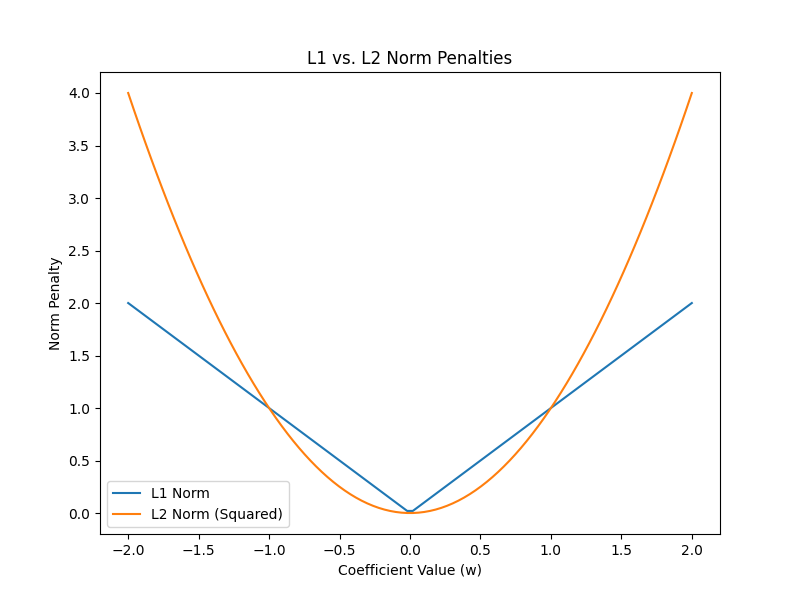

# Problem Statement and mathematical Formulation

All the mathematical details along with the statement can be found in the pdf file [README.md](https://github.com/sineshashi/ConvexOptimization/blob/main/lasso_regression/README.pdf) in the same folder.

# How to use?

First dump your data into csv where the feature columns should be present and a column name 'target' must be there which consist of the target values. Then simple run the script `solution.py` which prompts for input file name and hyperparamter `lambda` . Based on the inputs, it calculates and provides the optimal values of `w` and `b` in terminal.

# Choosing right hyperparameter lambda

In the plot above, it is visible that we get different hyperplanes which fits the model. To choose right lambda, we need to divide provided data into two spaces: training data and test data. Optimize the problem for training data and various values of lambda, for each values of lambda, calculate the total error in the test data. Choose the lambda with the least error. More advanced details regarding belongs to Machine Learning where hyperparameter tuning is studied well.

# Vs Ridge Regression (L2-Norm regularization)

To understand both regularization terms, first let us get into the difference of L1 and L2 norm. For that, first look into the following image:

We can see that for large coefficient values, L2 norm penalties can become larger than L1 penalties. However, the key difference lies in how they treat smaller coefficients. L1 norm penalizes them with a constant ratio, driving them towards zero and potentially leading to feature selection. In contrast, L2 norm's penalty for small coefficients is gentler, shrinking them but not eliminating them entirely.

This translates to distinct behaviors in Lasso and Ridge regression. L1's harsh penalty on small coefficients forces some of them to zero, effectively discarding irrelevant features and creating a sparser model. Ridge regression, with its gentler penalty, keeps all features in the model but reduces their influence. This can be beneficial for mitigating the impact of noisy data to some extent, as even irrelevant features might have a small effect.

The choice between Lasso and Ridge depends on the trade-off between:

* **Feature selection and interpretability:** Lasso can be easier to interpret due to fewer features, but might sacrifice some accuracy.
* **Preserving features and handling noise:** Ridge keeps all features, potentially capturing subtle effects, but the model might be more complex.

Ultimately, the optimal choice depends on your specific problem and priorities.
