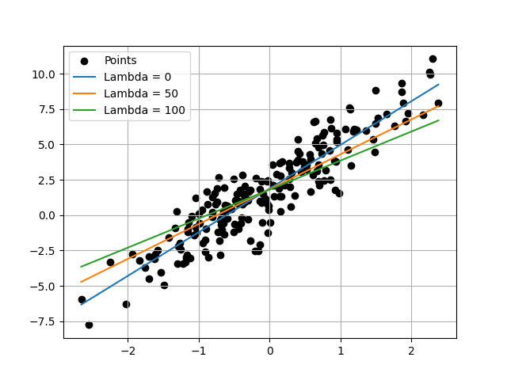

# Problem Statement and mathematical Formulation

All the mathematical details along with the statement can be found in the pdf file [README.pdf](https://github.com/sineshashi/ConvexOptimization/blob/main/linear_regression_with_ridge_regularization/README.pdf) in the same folder.

# How to use?

First dump your data into csv where the feature columns should be present and a column name 'target' must be there which consist of the target values. Then simple run the script `solution.py` which prompts for input file name and hyperparamter `lambda` . Based on the inputs, it calculates and provides the optimal values of `w` and `b` in terminal.

# Visualizing the case of single feature vector

When there is only a single feature in the space, we can visualize easily. For that `visualize.py` script is provided, before running it, put the model specific values in the `visualize.py` in the `VALUES` variable. We will find a plot like following:

# Choosing right hyperparameter lambda

In the plot above, it is visible that we get different hyperplanes which fits the model. To choose right lambda, we need to divide provided data into two spaces: training data and test data. Optimize the problem for training data and various values of lambda, for each values of lambda, calculate the total error in the test data. Choose the lambda with the least error. More advanced details regarding belongs to Machine Learning where hyperparameter tuning is studied well.
