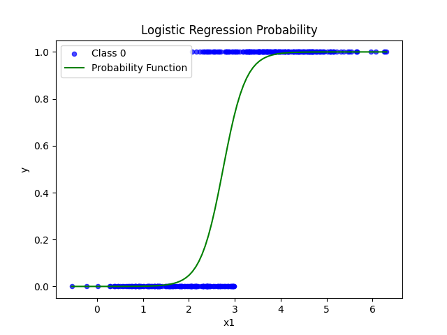

# Problem Statement and mathematical Formulation

All the mathematical details along with the statement can be found in the pdf file [README.pdf](https://github.com/sineshashi/ConvexOptimization/blob/main/logistics_regression/README.pdf) in the same folder.

# How to use?

First dump your data into csv where the feature columns should be present and a column name 'target' must be there which consist of the target values. Then simple run the script `solution.py` which prompts for input file name . Based on the inputs, it calculates and provides the optimal values of `w` and `b` in terminal.

# Interpretation of Logistics Regression

Logistic regression is employed when dealing with labeled data, where labels are binary (0 or 1), indicating two distinct groups. Its purpose is to predict the group for new data points. To achieve this, logistic regression fits the data into an activation function, typically the sigmoid function, which ranges between 0 and 1 and serves as a probability density function for data belonging to one of the groups.

In the image above, two sets of data are depicted, one labeled as 0 and the other as 1. The graph illustrates the optimal sigmoid function, representing the probability of a data vector belonging to the group labeled as 1. Lower values of the sigmoid function correspond to a higher probability of the vector belonging to label 0, while higher values indicate a higher probability of belonging to label 1.

Sometimes, logistic regression may suffer from overfitting. Regularization terms can be introduced to control this issue. While the sigmoid function is commonly used, in some cases, alternative activation functions like the hyperbolic tangent function may be preferred.

This succinct explanation clarifies the essence of logistic regression, its utilization in binary classification tasks, and strategies for mitigating overfitting.

# Extension to multiple groups

Logistic regression, initially designed for binary classification, can be extended to handle multiple groups using various techniques. Two of the simplest approaches are:

**1. One vs Rest (OvR)** : This technique involves training a separate logistic regression classifier for each group, treating it as the positive class while considering all other groups as the negative class. During prediction, the classifier with the highest probability is selected, effectively assigning each data point to one of the groups.

**2. Multinomial Logistic Regression** : Also known as softmax regression, this method generalizes logistic regression to support multiple classes directly. Instead of modeling the probability of belonging to a single group versus the rest (binary), multinomial logistic regression models the probability of belonging to each group simultaneously using the multinomial distribution function. It calculates the probability of each class and ensures that the sum of probabilities across all classes equals one.

Both techniques offer solutions for handling multiple groups within the logistic regression framework. The choice between them depends on factors such as the nature of the data, computational complexity, and interpretability requirements.
