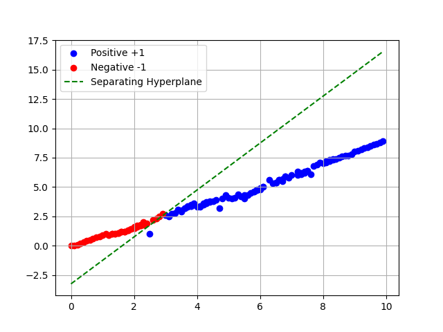

**Please find the problem details in README.pdf**
The file solution.py provides solution for the SVMs. When we run it, it will ask for a csv file which must contain a column output. Based the input data in the file, it prints out the optimal value, weight vector and bias term in the terminal.

If input vector is 2-dimensional, we can show the graph using the matplotlib. For that simply, run view.py script.

Here "input.csv" contains the sample input data in 2-dimensional space, the solution for that is weight vector (13.33333331, -6.66666665) and bias term is -21.6666666436286. If we plot the graph, we get the following image:

